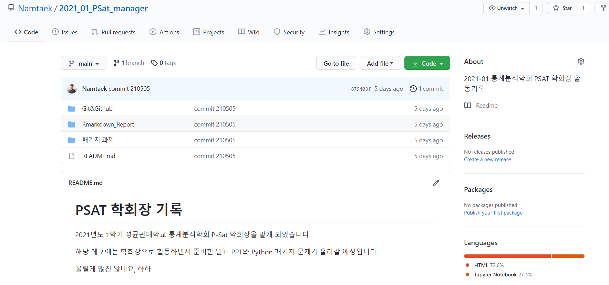
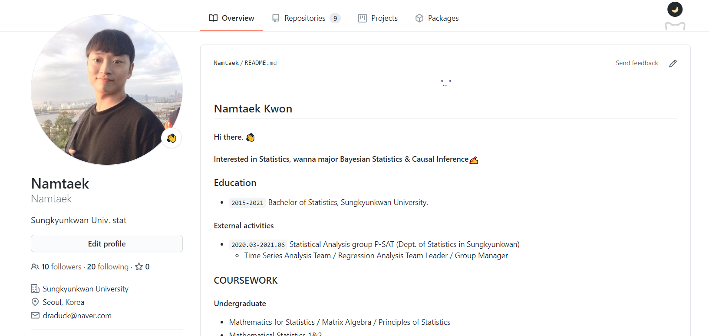

```{r setup, include=FALSE}
knitr::opts_chunk$set(echo = TRUE)
```

# 깃헙 관리하기

### 제출방법

- psat2009@naver.com로 본인의 깃헙 주소를 보내주세요.
  - 공지방에 게시판에 쓰라고 할까 했지만 공개하기 민망할 수 있으니 메일로 보내주세요!

- 패키지에 대한 발표는 따로 진행하지 않으려 합니다.
  - 하지만 패키지 수상은 존재합니다!

- 제출기한은 목요일 자정까지이며 지각시 벌금 5000원이 있습니다. 미제출 시 10000원 입니다.

\
\
\

#### 이번 학기 PSAT 활동을 본인의 깃헙에 저장해둡시다! 

전체적인 실행방법은 모두 Git&Github PPT 내용을 따라하시면 됩니다. 진짜 어렵지않아요!

제 [깃헙](https://github.com/Namtaek)을 참고하시면 됩니다!

https://github.com/Namtaek

**주의사항**

깃헙에는 큰 용량의 데이터 파일은 올라가지 않습니다. 따라서 로컬에서 커밋할때부터 가능하면 큰 용량의 데이터파일은 제외하고, 코드와 PPT위주로 올리시면 됩니다.


## 1. 깃헙 2021-01 PSAT 레포지토리 생성

```{r, echo = FALSE, fig.cap = '그림설명 부분', fig.align='center', out.width='90%'}

```

### 1.1 해당 레포에 대한 설명 작성하기

`README.md` 파일을 통해 해당 레포지토리에 대한 설명을 작성해주세요.

- md파일은 R studio - File - New File - Markdown File 로 R studio 내에서 작업 가능합니다.

### 1.2 해당 레포에 파일 업로드

해당 레포에 이번 학기 클린업(PPT와 각 팀 예시 코드), 주제분석(코드와 PPT), 패키지과제(본인의 코드)를 올려주세요. 다음과 같은 양식으로 올리셔도 되고, 보기 깔끔하게만 올려주시면 됩니다.

- 클린업
  - 클린업 1주차
  - 클린업 2주차
  - 클린업 3주차
  
- 주제분석
  - 주제분석 코드와 PPT
  
- 패키지 과제
  - 클린업 1주차 패키지
  - 클린업 2주차 패키지
  - 클린업 3주차 패키지
  - 주제분석 1주차 패키지
  - 주제분석 2주차 패키지
  - 주제분석 3주차 패키지

**만약에 모든 내용을 git bash를 통해 따라하는게 어렵다면, 그냥 로컬에서 파일을 정리하고 깃헙에 바로 업로드를 하셔도 괜찮습니다!**

## 2. 본인 깃헙 대문 꾸미기

```{r, echo = FALSE, fig.cap = '그림설명 부분', fig.align='center', out.width='90%'}

```

대문을 꾸미는 방법은 자유입니다. 하지만 기본적인 가이드는 드릴게요!

### 2.1 프로필 작성

- 사진의 좌측에 나오는 자신의 소속을 기입해 주세요.

### 2.2 대문꾸미기

- 자신에 대한 소개를 작성해주세요.
- 제가 드린 readme file은 예시입니다. 다르게 하셔도 괜찮아요!